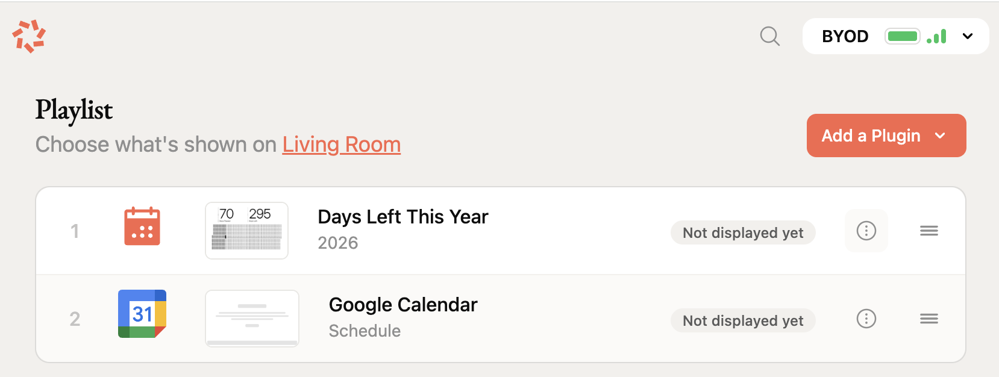
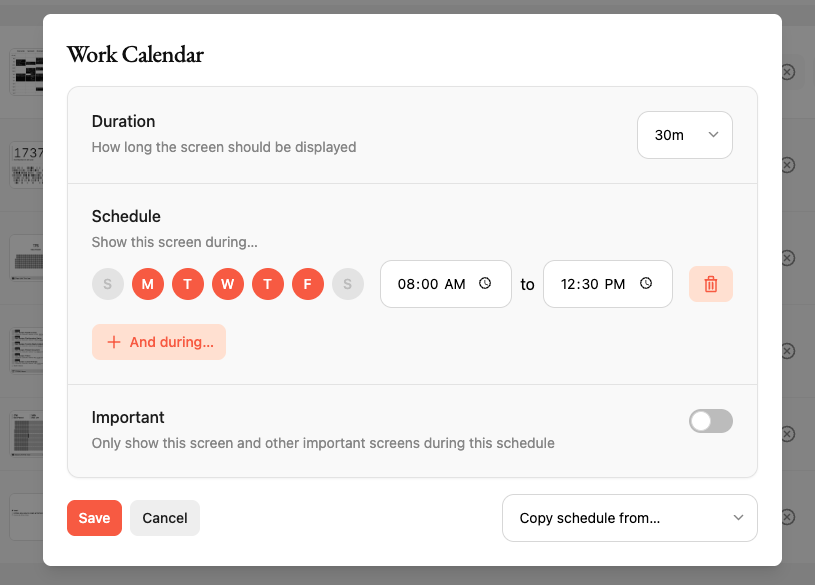

# BYOD/S

In the BYOD/S configuration, the only TRMNL IP is our [open source firmware](https://github.com/usetrmnl/firmware).

### Device setup

See our [alternate screens](https://github.com/usetrmnl/#alternative-screens-and-clients) and [BYOD guide](byod.md) for instructions to jailbreak or build a device that's compatible with our firmware.

### Server quickstart

The TRMNL web server generates PNG images. When a device pings our [Display API](../private-api/screens.md), the next-in-queue image is shared as an absolute URL inside a JSON response like this:

```
{
  "image_url"=>"https://trmnl.s3.us-east-2.amazonaws.com/path-to-img.png"
}
```

For ready-made OSS server clients, see [BYOS Implementations](https://docs.trmnl.com/go/diy/byos#implementations). To develop your own server that is TRMNL firmware compatible out of the box:

1. [Build or jailbreak a device](byod.md)
2. Change the base URL to your own server or local network from the WiFi Captive Portal
3. Mimic the `api/setup` and `api/display` endpoints per our [firmware README](https://github.com/usetrmnl/firmware)
4. Follow our [ImageMagick guide](imagemagick-guide.md) to create TRMNL firmware compatible images
5. Profit(?)

### Other infrastructure

In the quickstart above we glossed over a critical element: "next-in-queue" images.

At TRMNL we use a Playlists table to manage the ordering of plugin instances, letting users drag/drop different items in whatever sequence they prefer.

<figure><figcaption><p>Drag/Drop Playlists UI</p></figcaption></figure>

Each item in a Playlist is an _instance_ of a Plugin, which we call a PluginSetting.

This keeps our Plugins table immutable, for example Google Calendar is just a name, icon, and form field parameters. Meanwhile details about a _connection_ to Google Calendar are stored inside a PluginSetting record. Keep this in mind as you build your own server -- do you want to allow multiple connections to the same parent plugin?

TRMNL also offers a [Scheduler](https://help.trmnl.com/en/articles/11663305-playlist-scheduler). This makes it easy to dictate conditions for when and why a given plugin is displayed on your device.

<figure><figcaption><p>Playlist scheduler in action</p></figcaption></figure>

Following our architecture is unnecessary for a self-hosted ePaper dashboard, but we do encourage you to check out those which have already been implemented in [BYOS clients](byos.md).
