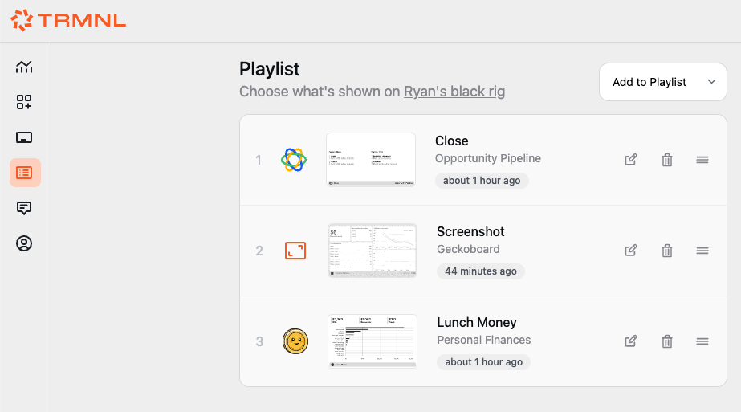

# BYOD/S

In the BYOD/S model, the only TRMNL IP is our [open source firmware](https://github.com/usetrmnl/firmware). Technically we don't owe you any explanation to get up and running, but we'll do it anyway. ;)

### Device setup

See our [BYOD guide](byod.md) for instructions to build a device that's compatible with our firmware.

### Server quickstart

The TRMNL web server generates bitmap images. When a device pings our web server, the next-in-queue image is shared as an absolute URL inside a JSON response like this:

```
{
  "image_url"=>"https://trmnl.s3.us-east-2.amazonaws.com/path-to-img.bmp"
}
```

You can demo this process from the command line by installing [ImageMagick](https://en.wikipedia.org/wiki/ImageMagick), then invoking `convert` command. Visit our [imagemagick guide](../imagemagick-guide.md)

With this in mind, building your own server simply necessitates creating an endpoint that responds with links to firmware-compatible Bitmap images.

Assuming you've set up a device, simply...

1. change the base URL to your own server or local network from the WiFi Captive Portal
2. mimic the `api/setup` and `api/display` endpoints to respond per the [firmware readme](https://github.com/usetrmnl/firmware)
3. profit

### Other infrastructure

In the quickstarter above we glossed over a critical element: "next-in-queue" images.

At TRMNL we use a Playlists table to manage the ordering of plugin instances, so that users can drag/drop different screen content in any sequence they like.

<figure><figcaption><p>Drag/Drop Playlists UI</p></figcaption></figure>

Each item in a device's Playlist is an instance\* of a Plugin, something we call a PluginSetting.

This keeps our Plugins table immutable, for example our Google Calendar record contains just name, icon, etc. But details about an actual connection to Google Calendar are stored inside a PluginSetting record. Keep this in mind as you build your own server -- do you want to allow multiple connections to the same parent plugin?

TRMNL also supports PlaylistGroups. These are parent objects to playlists, and they simply act as buckets to which playlist items should be rendered on a device during any given time period.

<figure><figcaption><p>Playlist Groups in action</p></figcaption></figure>

This is another feature to consider building on your own implementation, but does not need to be considered at the device or firmware level.
