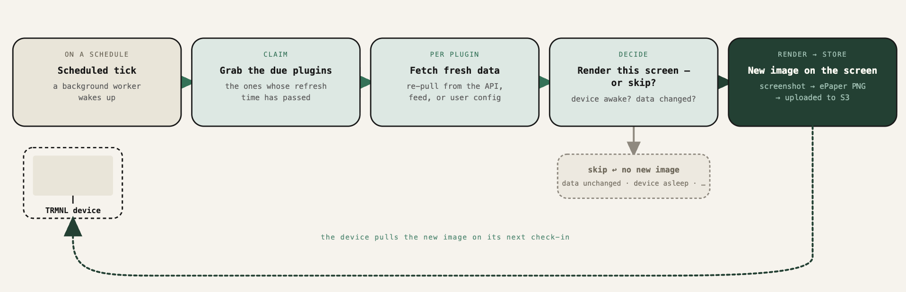

# How it Works

<figure> server lifecycle"><figcaption>
Device, Server, Plugin Sync, Screen Render
</figcaption></figure>

The TRMNL **web server** hosts a growing directory of [first-party plugins](https://trmnl.com/integrations) and [community plugins](https://trmnl.com/recipes) that are driven by [API endpoints](https://trmnl.com/api-docs) + a [templating engine](https://help.trmnl.com/en/articles/10671186-liquid-101). Our [Framework UI](https://trmnl.com/framework) design system is recommended, but not required, for plugin development. Learn how to build custom plugins [here](https://help.trmnl.com/en/articles/9510536-private-plugins).

Our [native devices](https://shop.trmnl.com/collections/devices) feature custom PCBs powered by ESP32 controllers ranging from C3 Mini to S3 and C5, 1800-6000 mAh LiPo batteries, and 7.5" - 10.3"+ EPD screens housed in injection-molded PC or ABS soft touch plastic. Customers may disassemble their device and mod their firmware without impacting our [Terms of Service](https://trmnl.com/terms).

TRMNL **firmware** supports automatic OTA (over the air) updates to WiFi-connected devices and is [open source](https://github.com/usetrmnl/firmware). Here's how it works:

1. Device wakes up and requests content from web server every _n_ period\*
2. Web server generates a 1- or 2-bit PNG image. Response JSON includes a link to this image and timing instructions for the next "refresh" request.
3. Device renders the content, then goes to sleep for the instructed amount of time.


\* "Displayable content" is the most recently created screen, in order of priority according to the [Playlists](https://help.trmnl.com/en/articles/11663305-playlist-scheduler) interface. "N" is a value in minutes, configurable by customers at a per-plugin or per-device level.


## Opinionated device <> server relationship

Most IoT products support SSH-ing directly into peripheral devices. We've heard too many horror stories about how this can go wrong, and decided to invert the paradigm.

**Your TRMNL device pings our server, never the other way around**.

Each request to our `/api/display` endpoint ([docs](https://docs.trmnl.com/go/private-api/screens)) includes only the minimum details needed to support customers -- an API key, device mac address, firmware version, battery voltage, and WiFi signal strength.

**We do not collect any footprint of your location or identity**, such as IP address or WiFi credentials. Your local network's SSID and password are stored only on your TRMNL device.

When the TRMNL web server responds to a device's request we include only a few fields. These include `update_firmware` (true/false), a direct download link to the firmware's \[public] binary package, and whether the device should be reset. Customers may disable OTA updates, reset their device to transfer ownership, or destroy data from their web account.

**TRMNL does not store rendered content over time.**

Whenever the web server generates a new image it replaces the previous image. This [keeps our costs low](https://x.com/useTRMNL/status/1892058143636476374), affording perpetual service without subscription fees. This also protects users because we only have access to the most recent screen rendered for each of your plugins.
