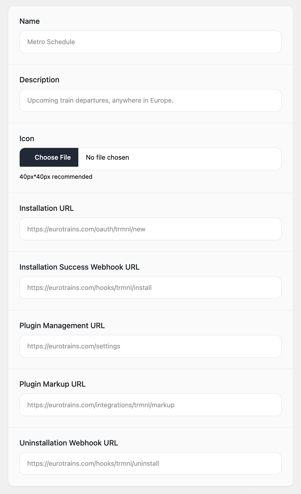

# Plugin Creation

You can create a new plugin by visiting the following URL:

```
https://trmnl.com/plugins/my/new
```

<figure><figcaption><p>TRMNL public plugin client</p></figcaption></figure>

You'll have to provide the following information about your plugin.

**Name**: Branded title (if applicable, ex "Vandelay Industries") or brief tag that describes the plugin's functionality

**Description**: Additional text to help differentiate your plugin from others

**Icon**: PNG format preferred

**Installation URL**: Endpoint where TRMNL should trigger the installation flow

**Installation Success Webhook URL**: Where you want to receive installation success events as a webhook

**Plugin Management URL**: Where TRMNL users can manage their plugins

**Plugin Markup URL:** Endpoint where TRMNL should ping your webserver for markup content

**Uninstallation Webhook URL**: Where you want to receive uninstallation events as a webhook
