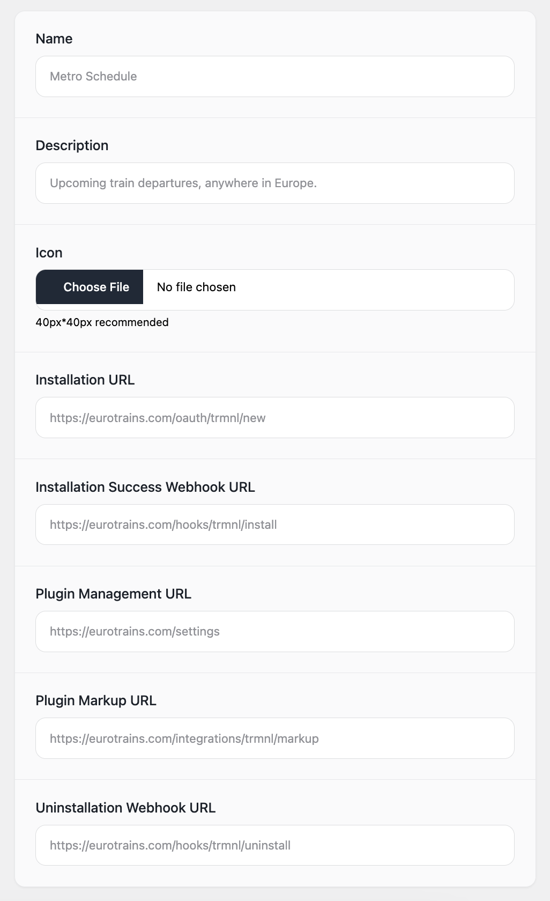

# Plugin Creation

You can create a new plugin by visiting the following URL:

```
https://trmnl.com/plugins/my/new
```


Building Third Party plugins requires the Developer Edition upgrade on your device. Without it, this page redirects to our upgrade screen.


<figure><figcaption><p>TRMNL public plugin client</p></figcaption></figure>

You'll have to provide the following information about your plugin.

**Name**: Branded title (if applicable, ex "Vandelay Industries") or brief tag that describes the plugin's functionality

**Description**: Additional text to help differentiate your plugin from others, 35 characters max

**Icon**: PNG or SVG, 512x512px recommended

**No Screen Padding**: Removes the outermost padding when your plugin renders full screen

**Category**: Up to 3 categories that help users find your plugin in our [directory](https://trmnl.com/integrations)

**Supported Refresh Interval**: The fastest refresh interval your plugin can support, from every 15 minutes to once a day. Users can't pick a faster interval than this for their instance

**Installation URL**: Endpoint where TRMNL should trigger the [installation flow](plugin-installation-flow.md)

**Installation Success Webhook URL**: Where you want to receive installation success events as a webhook

**Plugin Management URL**: Where TRMNL users can [manage their plugins](plugin-management-flow.md)

**Plugin Markup URL:** Endpoint where TRMNL should ping your webserver for [markup content](plugin-screen-generation-flow.md)

**Uninstallation Webhook URL**: Where you want to receive [uninstallation events](plugin-uninstallation-flow.md) as a webhook

**Knowledge Base URL**: A setup guide for your plugin. We link to it from the plugin's settings page

Every field is required. After you save, your plugin shows up under **My Plugins** (`https://trmnl.com/plugins/my`) with its status, a Client ID + Client Secret, an **Edit** button and an **Install** button. Use **Install** to run the full flow against your own account while the plugin is still in development -- other users can't install it until it's [published](going-live.md).
