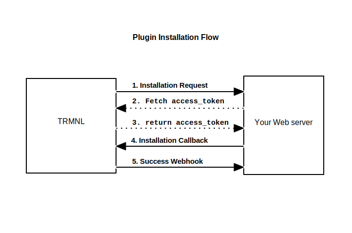

# Plugin Installation Flow

<figure><figcaption></figcaption></figure>

Third Party plugins use a simplified OAuth2 flow. There is no `client_id` or `client_secret` to manage — TRMNL identifies your plugin by the URLs you registered during [Plugin Creation](plugin-creation.md), and each installation is authorized by a single-use `code`.

1. **Installation Request**

When a user installs your plugin, TRMNL redirects their browser to your `installation_url`. This is a `GET` request, so both parameters arrive in the query string (URL-encoded):

* `code` — a single-use installation code, unique to this user + plugin
* `installation_callback_url` — the TRMNL URL you send the user back to once installation is complete (see Step 4)

```bash
GET 'https://your-server.com/your-installation-url?code=abc123&installation_callback_url=https%3A%2F%2Ftrmnl.com%2Fplugin_settings%2Fnew%3Fkeyname%3Dyour_plugin%26code%3Dabc123'
```

2. **Fetch Access Token**

Exchange the `code` from Step 1 for an `access_token` by sending a `POST` request to TRMNL's token endpoint. The `code` is the only parameter required, sent as a form-encoded body:

```bash
curl -XPOST 'https://trmnl.com/oauth/token' \
-H 'Content-Type: application/x-www-form-urlencoded' \
-d 'code=abc123'
```

3. **Access Token**

TRMNL responds with a JSON body containing the `access_token`. Persist this token — you'll use it as the Bearer token to authenticate the [screen generation](plugin-screen-generation-flow.md) requests TRMNL sends to your server.

```json
{ "access_token": "a1b2c3d4e5f6..." }
```

If the `code` is missing or invalid, TRMNL responds with an error body instead (note: the HTTP status is still `200`):

```json
{ "error": true, "message": "invalid code" }
```

4. **Installation Callback**

Redirect the user's browser to the `installation_callback_url` you received in Step 1. This `GET` redirect returns them to TRMNL to finish connecting the plugin.

```bash
GET '<installation_callback_url>'
```

5. **Success Webhook**

Once the user has finished installing the plugin, TRMNL sends a `POST` request to your `installation_success_webhook_url`. The request is authenticated with the user's `access_token` and the body is JSON.

HTTP Headers:

```
Authorization: Bearer <access_token>
Content-Type: application/json
```

Body:

```json
{
  "user": {
    "id":5678,
    "name":"Ronak J",
    "email":"ronak@trmnl.com",
    "first_name":"Ronak",
    "last_name":"J",
    "locale":"en",
    "time_zone":"Pacific Time (US & Canada)",
    "time_zone_iana":"America/Los_Angeles",
    "utc_offset":-28800,
    "plugin_setting_id":1234,
    "uuid": "674c9d99-cea1-4e52-9025-9efbe0e30901"
  }
}
```

Time zone mappings are available here under "Constants:"\
[https://api.rubyonrails.org/classes/ActiveSupport/TimeZone.html](https://api.rubyonrails.org/classes/ActiveSupport/TimeZone.html)

The `plugin_setting_id`is useful for building a redirect URI in your own application, for example to send a user back to trmnl.com/plugin\_settings/:plugin\_setting\_id/edit.
