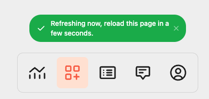

# Plugin Management Flow

<figure><figcaption></figcaption></figure>

After a user installs your plugin, they may want to manage the plugin settings. TRMNL will redirect the user to the `plugin_management_url` with a unique user identifier (UUID) params, so that you can identify them on your web server.

Example request:\
`https://yourapp.com/manage?uuid=ae48d6ac-48f4-4aed-8464-bad68368e97c`

**Note**: The UUID is the unique user identifier in the TRMNL plugin architecture. This allows TRMNL users to have multiple instances of the same plugin, each with their own settings.

If you saved the `plugin_setting_id` from the [Installation Flow](plugin-installation-flow.md), you can build a helpful "Back to TRMNL" button in your Management UI.&#x20;

By appending `?force_refresh=true` to your return link, TRMNL will invoke a [Screen Generation request](plugin-screen-generation-flow.md) on the user's behalf and present a toast message when they're back inside the TRMNL application.

<figure><figcaption>
Force Refresh toast message
</figcaption></figure>
