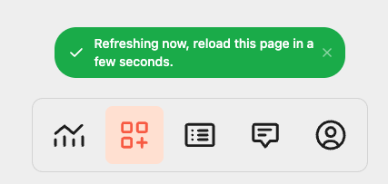

# Plugin Management Flow

<figure><figcaption></figcaption></figure>

After a user installs your plugin, they may want to manage the plugin settings. The instance's settings page on TRMNL shows a **Configure <your plugin>** button that opens your `plugin_management_url` in a new tab, with 2 query params: the instance `uuid` + a signed `jwt`.

Example request:\
`https://yourapp.com/manage?uuid=ae48d6ac-48f4-4aed-8464-bad68368e97c&jwt=eyJraWQiOi...`

**Note**: The UUID is the unique user identifier in the TRMNL plugin architecture. This allows TRMNL users to have multiple instances of the same plugin, each with their own settings.


TRMNL appends `?uuid=...` to your URL as-is, so register a `plugin_management_url` without a query string of its own.


**Verify the JWT before trusting the UUID.** Anyone can type a UUID into a URL; only TRMNL can sign the token. It's an `RS256` JWT with a `kid` header, and our public keys live at:

```
https://trmnl.com/.well-known/jwks.json
```

Its claims:

```json
{
  "sub": "ae48d6ac-48f4-4aed-8464-bad68368e97c",
  "aud": "<your plugin's Client ID>",
  "iat": 1747596567,
  "exp": 1747596687
}
```

Check that `sub` matches the `uuid` param and `aud` matches the Client ID shown under [My Plugins](https://trmnl.com/plugins/my). The token expires 2 minutes after TRMNL issues it, so verify it on landing + start your own session from there.

If you saved the `plugin_setting_id` from the [Installation Flow](plugin-installation-flow.md), you can build a helpful "Back to TRMNL" button in your Management UI.&#x20;

By appending `?force_refresh=true` to your return link (`https://trmnl.com/plugin_settings/:plugin_setting_id/edit?force_refresh=true`), TRMNL will invoke a [Screen Generation request](plugin-screen-generation-flow.md) on the user's behalf and present a toast message when they're back inside the TRMNL application. Each forced refresh counts against the account's hourly allowance of manual refreshes.

<figure><figcaption><p>Force Refresh toast message</p></figcaption></figure>
