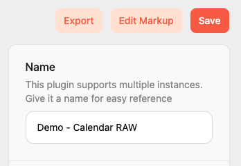
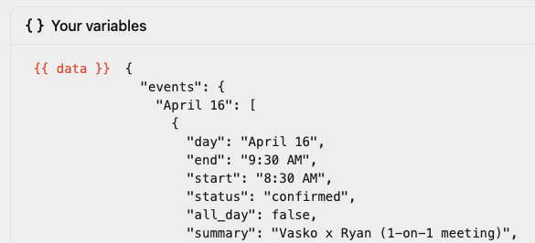

# Fetch Plugin Content

No matter how many customizations we add to native plugins, there will always be a good reason to change them. Instead of cluttering our interface and adding complexity for other users, TRMNL offers a "data only" mode for select native plugins.


For more context on this feature, go [here](https://usetrmnl.com/blog/calendar-hackathon).


### How it works

First, set up + hide an instance of the plugin you want to re-build yourself with raw data. This instructs TRMNL to sync and parse data on your behalf.

1. Connect the Weather, Stock Prices, or any Calendar plugin (email support@usetrmnl.com to make additional native plugins Data Mode friendly)
2. Make note of the PluginSetting integer ID in the URL (`/plugin_settings/<id-here>`)
3. Navigate to Playlists and "hide" the native plugin that was automatically added by clicking the eyeball icon. **This is important** because only plugins on a live playlist will be refreshed. By hiding to avoid this native plugin, your Data Mode plugin (below) will always have fresh data.

Next, build a Private Plugin.

1. Navigate to Plugins > Private Plugin, select "Polling" as the Strategy
2. Input `https://usetrmnl.com/api/plugin_settings/<id-here>/data` as the Polling URL
3. Input `authorization=bearer <your-user-api-key>`  as the Polling Header\*

\*Find or generate a [User API Key](https://help.usetrmnl.com/en/articles/11195228-user-level-api-keys) on your Account tab

Click save, then enter the Markup Editor.&#x20;

<figure><figcaption>
Private Plugin > Edit Markup
</figcaption></figure>

Parsed data will appear inside a `data` node of the "Merge Variables" dropdown. You may need to click "Force Refresh" from the private plugin settings view to ensure the data has been fetched.

<figure><figcaption>
Example - Google Calendar "data mode"
</figcaption></figure>

### Markup Quickstart

If you only want to make small changes to the TRMNL native design, you can steal that markup here:

[https://usetrmnl.com/plugins/demo](https://usetrmnl.com/plugins/demo) (requires login)

Just click the plugin you're rebuilding, and all layouts will appear with sample data embedded. If you've connected a plugin natively, your latest cached JSON will be embedded instead of demo data.
