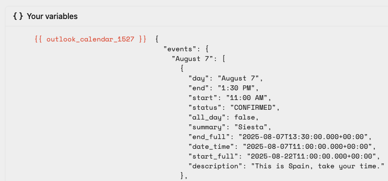

# Plugin Data API

No matter how many customizations we add to plugins, there will always be good reasons to add more. Instead of cluttering our interface, TRMNL offers a "data only" mode.


For more context on this feature, go [here](https://usetrmnl.com/blog/calendar-hackathon). For live examples, [go here](https://usetrmnl.com/blog/introducing-data-mode).


### Looking for the old way?

Go here to set up a Data Mode plugin the ~~old~~ [hard way](https://github.com/usetrmnl/api-docs/blob/4ce6efd395d26bfecc4d7e271ed758ebaa02283b/private-api/fetch-plugin-content.md).

### How it works

First, set up + hide an instance of the plugin you want to modify.

1. Connect a plugin, for example the Weather, Stock Prices, Calendar, etc
2. Navigate to Playlists and "hide" the plugin (click the eyeball icon), assuming you don't want to see its native form on your device. **This is important** because only plugins on a Playlist will sync fresh data.

Next, build a Private Plugin.

1. Navigate to Plugins > Private Plugin, select "Plugin Merge" as the Strategy
2. Click Edit Markup

<figure><figcaption>
Private Plugin > Edit Markup
</figcaption></figure>

Parsed data will appear inside a `<plugin_keyname>_<plugin_setting_id>` node of the "Merge Variables" dropdown. You may need to click "Force Refresh" from the private plugin settings view to ensure data has been fetched.

<figure><figcaption>
Example - Outlook Calendar events JSON
</figcaption></figure>

Reference as many connected plugins as you'd like. When TRMNL refreshes those plugins per your [Playlist Schedule](https://help.usetrmnl.com/en/articles/11663305-playlist-scheduler), updated values will map over to your private plugin with the Plugin Merge strategy.

### Markup Quickstart

If you only want to make small changes to the TRMNL native design, steal that markup here:

* [https://github.com/usetrmnl/plugins/](https://github.com/usetrmnl/plugins/) (raw inside `lib`, let us know what else you need)
* [https://usetrmnl.com/plugins/demo](https://usetrmnl.com/plugins/demo) (rendered output, requires login)

In the raw/GitHub option, note that native plugins leverage the ERB templating language, so markup `<% variable %>` references will need to be replaced with Liquid `{{ variable }}` and so forth.

In the `/demo` option, click the plugin you're rebuilding and all layouts will appear with sample data. If you've connected a plugin natively, your latest cached JSON will be embedded instead of demo data.

Another tip on the `/demo` option is to add `?data=true` to the URL, for example `https://usetrmnl.com/plugins/google_calendar?data=true` to see how TRMNL combines your own JSON data with our native ERB markup. If you have multiple instances that you'd like to check out, also append `&plugin_setting_id=<id-here>` to render a specific plugin instance on the demo page.
