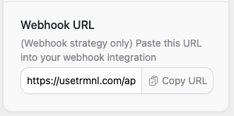

# Create a screen


### Before you begin

Creating screens requires a Private Plugin instance inside your TRMNL account. This is currently available via the web interface only. Simply navigate to [Plugins > Private Plugin > New](https://usetrmnl.com/plugin_settings/new?keyname=private_plugin).

**Only devices with the Developer add-on** may access their own Access Token. You may unlock this feature anytime from your [Devices > Edit](https://usetrmnl.com/devices/) page for a one-time fee.e a screen (webhook strategy)


If your private plugin's "Strategy" is set to Webhook, you can provide data to TRMNL's server at any  time.

Simply send a `POST` request to the instance's Webhook URL, accessible from the configuration form. The below example updates the Plugin with UUID "asdfqwerty1234" using dynamic values inside a "merge\_variables" node:

```
curl "https://usetrmnl.com/api/custom_plugins/asdfqwerty1234" \
  -H "Content-Type: application/json" \
  -d '{"merge_variables": {"text":"You can do it!", "author": "Rob Schneider"}}' \
  -X POST
```

The Plugin's UUID value (`asdfqwerty1234` in the example above) will associate your payload with the Markup you already provided when you [created your private plugin](https://help.usetrmnl.com/en/articles/9510536-custom-plugins).

To retrieve your Plugin's Webook URL / UUID, visit your private plugin instance. Note that you must "save" (create) the private plugin before a UUID and Webhook URL will be generated.

<figure><figcaption><p>Private Plugin Webhook URL w/ UUID</p></figcaption></figure>

## Create a screen (polling strategy)

If your private plugin's "Strategy" is set to Polling, the TRMNL server will periodically fetch for new data from an endpoint of your choice.

Simply provide a "Polling URL" inside your private webhook instance (web UI), and TRMNL will make a `GET` request to that URL. To test this quickly, we've prepared an endpoint that responds with `text` and `author` key/value pairs, along with a `collection` array for quick demonstration:

[https://usetrmnl.com/custom\_plugin\_example\_data.json](https://usetrmnl.com/custom_plugin_example_data.json)

If your desired polling URL contains a collection/array in the root node, TRMNL will nest it inside a key named "data" for accessibility by the Liquid templating engine. Here is an example of that style payload:

[https://usetrmnl.com/custom\_plugin\_example\_data.json?collection\_only=true](https://usetrmnl.com/custom_plugin_example_data.json?collection_only=true)

**Note**: With the Polling strategy, variables _do not_ need to be nested within a "merge\_variables" node. That is only a requirement for the Webhook strategy.

## Troubleshooting

For more assistance, see our [Private Plugin Tutorial](https://help.usetrmnl.com/en/articles/9510536-custom-plugins) or email team@usetrmnl.com.
