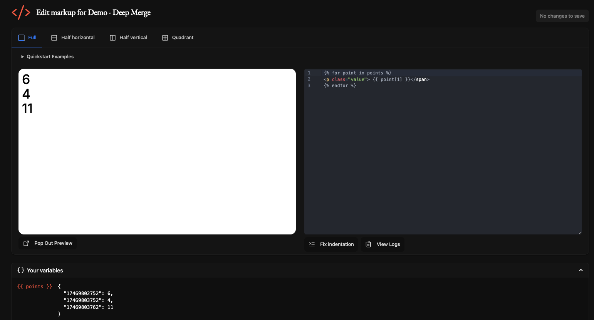

# Create a screen


### Before you begin

Creating screens requires a Private Plugin instance inside your TRMNL account. This is currently available via the web interface only. Simply navigate to [Plugins > Private Plugin > New](https://usetrmnl.com/plugin_settings/new?keyname=private_plugin).


If your private plugin's "Strategy" is set to Webhook, you can provide data to TRMNL's server up to 1x every 5 mins. Requests sent at a faster pace will receive a `429` rate limit response.

### Authorization

TRMNL has Device API Keys, User API Keys, and Plugin Setting UUIDs. For private plugin screen generation, we'll use your Plugin Settings UUID.

This is accessible from your plugin instance's configuration form, in a field called Webhook URL.

<figure><figcaption><p>Private Plugin Webhook URL w/ UUID</p></figcaption></figure>


**Note:**  you must "save" (create) a private plugin instance before a UUID and Webhook URL will be generated.


### Set new content

Send a `POST` request to your Webhook URL. Put data inside a `merge_variables` node like so:

```
curl "https://usetrmnl.com/api/custom_plugins/asdfqwerty1234" \
  -H "Content-Type: application/json" \
  -d '{"merge_variables": {"text":"You can do it!", "author": "Rob Schneider"}}' \
  -X POST
```

You will see this payload inside the Your Variables dropdown of the Markup Editor.

<figure><figcaption><p>Your variables - available inside the Markup Editor</p></figcaption></figure>

### Update existing content

If your private plugin needs to maintain state over time, for example an ever growing todo list or a data visualization, you may prefer to send only "new" data points to your TRMNL plugin.

For this use case, add `deep_merge: true` to your payload like so:

```
curl "https://usetrmnl.com/api/custom_plugins/asdfqwerty1234" \
  -H "Content-Type: application/json" \
  -d '{"merge_variables": {"points": {"17469803752": 4}}, "deep_merge": "true"}' \
  -X POST
```

Now you may iterate through your previous + new key/value pairs inside your markup, for example:

<figure><figcaption></figcaption></figure>

## Create a screen (polling strategy)

If your private plugin's "Strategy" is set to Polling, the TRMNL server will periodically fetch for new data from an endpoint of your choice.

Simply provide 1 or more "Polling URL" inside your private plugin's configuration form, and TRMNL will make requests to those URLs. For quick testing, we've prepared an endpoint that responds with `text` and `author` key/value pairs, along with a `collection` array for quick demonstration:

[https://usetrmnl.com/custom\_plugin\_example\_data.json](https://usetrmnl.com/custom_plugin_example_data.json)

If your desired polling URL contains a collection/array in the root node, TRMNL will nest it inside a key named "data" for accessibility by the Liquid templating engine. Here is an example of that style payload:

[https://usetrmnl.com/custom\_plugin\_example\_data.json?collection\_only=true](https://usetrmnl.com/custom_plugin_example_data.json?collection_only=true)


**Note**: With the Polling strategy, variables _do not_ need to be nested within a `merge_variables` node. That is only a requirement for the Webhook strategy.


## Troubleshooting

For more help, see our [Private Plugin guide](https://help.usetrmnl.com/en/articles/9510536-custom-plugins) or join the developer Discord from your account tab.
