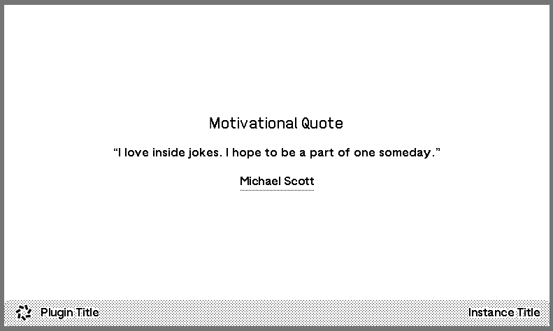
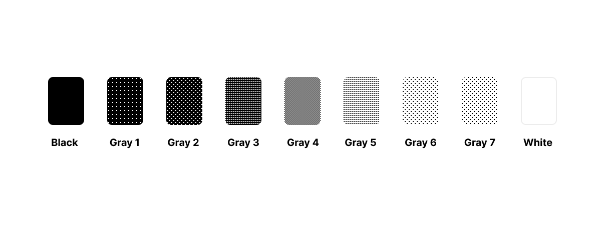
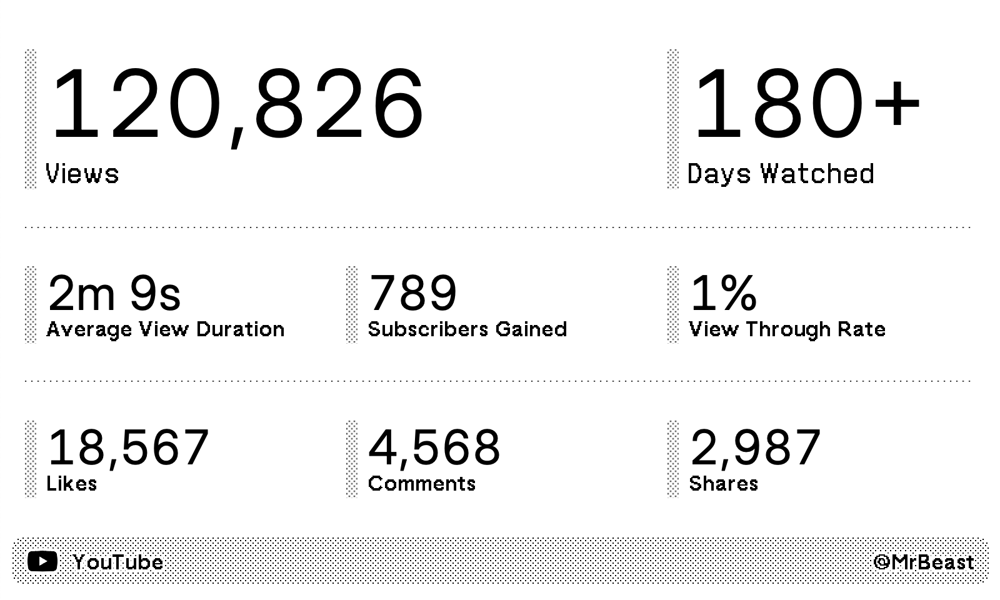

# 🖼️ Plugin Templating (DEPRECATED, hidden)

## Overview

The TRMNL device is an **800x480 pixel, black and white, 1-bit grayscale display**.  This meant we had to abandon a lot of modern web styling techniques when developing the API. For example: no gradients, no fancy typeface, and no anti-aliasing.

We replaced each of these strategies with dithering patterns, bitmap fonts, and a TRMNL-flavored design system. In these docs you'll learn how to adopt our system to build your own beautiful plugins.

## Quickstart

Create an HTML file with our plugins CSS embedded in the `<head>`.

```erb
<!DOCTYPE html>
<html>
  <head>
    <link rel="stylesheet" href="https://usetrmnl.com/css/latest/plugins.css">
  </head>
  <body class="environment trmnl">
    <div class="screen">
      <div class="view view--full">
        <div class="layout">
          <div class="columns">
            <div class="column">
              <div class="markdown">
                <span class="title">Motivational Quote</span>
                <div class="content content--center">“I love inside jokes. I hope to be a part of one someday.”</div>
                <span class="label label--underline">Michael Scott</span>
              </div>
            </div>
          </div>
        </div>
        
        <div class="title_bar">
          
          <span class="title">Plugin Title</span>
          <span class="instance">Instance Title</span>
        </div>
      </div>
    </div>
  </body>
</html>
```

The above markup should produce a screen like this:

<figure><figcaption><p>Sample screen render with TRMNL's plugin CSS stylesheet</p></figcaption></figure>

After designing a screen to your liking (more examples below), replace dynamic content with `{{ variable }}` references. TRMNL uses the [Liquid templating library](https://shopify.github.io/liquid/) by Shopify to interpolate values into your template markup.

Next,  extract inner the `<div class="view view--full">` content and paste it into the Markup field of a [custom plugin](https://help.usetrmnl.com/en/articles/9510536-custom-plugins) inside your TRMNL account.


[Tutorial - How to create a custom plugin](https://help.usetrmnl.com/en/articles/9510536-custom-plugins)


**Note**: You may also leverage [Liquid Filters](https://shopify.dev/docs/api/liquid/filters) to reduce the sanitization required by the service producing data for your TRMNL plugins. For example, you can convert "10" to "$10.00" via [money\_with\_currency](https://shopify.dev/docs/api/liquid/filters/money).

## Basic Structure

```erb
<div class="layout">
  <div class="columns">
    <div class="column">
      {{ content }}
    </div>
  </div>
</div>

<div class="title_bar">
  
  <span class="title">{{ plugin_name }}</span>
  <span class="instance"> {{ instance_name }}</span>
</div>
```

## Columns

Place content inside a single or multiple `column` class  divs.

This ensures that the content is centered vertically on the screen, and aligned to the top of the column with with most content.

```erb
<div class="layout">
  <div class="columns">
    <div class="column">
      {{ content }}
    </div>
  </div>
</div>
...
```

## Gray Scale

Use `r-bg-{{ shade }}` classes to define background patterns from the gray scale.

<figure><figcaption><p>Grayscale shades</p></figcaption></figure>

<table><thead><tr><th width="183">Shade</th><th>Class</th></tr></thead><tbody><tr><td>Black</td><td><code>r-bg-black</code></td></tr><tr><td>Gray 1</td><td><code>r-bg-gray-1</code></td></tr><tr><td>Gray 2</td><td><code>r-bg-gray-2</code></td></tr><tr><td>Gray 3</td><td><code>r-bg-gray-3</code></td></tr><tr><td>Gray 4</td><td><code>r-bg-gray-4</code></td></tr><tr><td>Gray 5</td><td><code>r-bg-gray-5</code></td></tr><tr><td>Gray 6</td><td><code>r-bg-gray-6</code></td></tr><tr><td>Gray 7</td><td><code>r-bg-gray-7</code></td></tr><tr><td>White</td><td><code>r-bg-white</code></td></tr></tbody></table>

## Components

### Title & Description

<figure><figcaption></figcaption></figure>

```ruby
<span class="title">Title</span>
<span class="title title--small">Title Small</span>
<span class="description">Description</span>
```

### Label

<figure><figcaption></figcaption></figure>

```ruby
<span class="label">Label</span>
<span class="label label--underline">Label Underline</span>
<span class="label label--small">Label Small</span>
<span class="label label--small label--underline">Label Small Underline</span>
```

### Value

<figure><figcaption></figcaption></figure>

```ruby
<span class="value value--xxlarge">24,276</span>
<span class="value value--xlarge">24,276</span>
<span class="value value--large">24,276</span>
<span class="value">24,276</span>
<span class="value value--small">24,276</span>
<span class="value value--xsmall">24,276</span>
```

### Grid

Here's a simple grid markup of an equal three column grid, with gaps between the columns:

```
<div class="grid grid--cols-3 gap-4">
  <div>...</div>
  <div>...</div>
  <div>...</div>
</div>
```

### Item

<figure><figcaption><p>Example of List components</p></figcaption></figure>

```erb
<div class="item">
  <div class="meta">
    <span class="index">1</span>
  </div>
  <div class="content">
    <span class="title title--small">Monthly Catchup with Dev Team</span>
    <span class="description">A monthly meeting to discuss progress and obstacles with the development team</span>
    <div class="flex gap-2">
      <span class="label label--small label--underline">10:00 - 11:00</span>
      <span class="label label--small label--underline">Confirmed</span>
    </div>
  </div>
</div>
```

### Table

<figure><figcaption></figcaption></figure>

```ruby
<table class="table">
  <thead>
    <tr>
      <th><span class="label label--small">Metric</span></th>
      <th><span class="label label--small">Value</span></th>
    </tr>
  </thead>
  <tbody>
    <tr>
      <td><span class="title title--small">Recipients</span></td>
      <td><span class="label">20,129</span></td>
    </tr>
    <tr>
      <td><span class="title title--small">Open rate</span></td>
      <td><span class="label">6.55%</span></td>
    </tr>
    <tr>
      <td><span class="title title--small">Click rate</span></td>
      <td><span class="label">0.76%</span></td>
    </tr>
    <tr>
      <td><span class="title title--small">Unsubscribes</span></td>
      <td><span class="label">14</span></td>
    </tr>
    <tr>
      <td><span class="title title--small">Clicks</span></td>
      <td><span class="label">654</span></td>
    </tr>
    <tr>
      <td><span class="title title--small">Status</span></td>
      <td><span class="label">Completed</span></td>
    </tr>
  </tbody>
</table>
```

### Fully built Plugin

<figure><figcaption></figcaption></figure>

```
<div class="layout layout--col gap--space-between">
  <div class="grid gap--[11px]">
    <div class="col-span-2">
      <div class="item">
        <div class="meta"></div>
        <div class="content">
          <span class="value value--xlarge value--tnums">120,826</span>
          <span class="label label--large">Views</span>
        </div>
      </div>
    </div>
    <div class="col-span-1">
      <div class="item">
        <div class="meta"></div>
        <div class="content">
          <span class="value value--xlarge value--tnums">180+</span>
          <span class="label label--large">Days Watched</span>
        </div>
      </div>
    </div>
  </div>
  <div class="w-full b-h-gray-5"></div>
  <div class="grid grid--cols-3">
    <div class="item">
      <div class="meta"></div>
      <div class="content">
        <span class="value value--tnums">
          2m 9s
        </span>
        <span class="label">Average View Duration</span>
      </div>
    </div>
    <div class="item">
      <div class="meta"></div>
      <div class="content">
        <span class="value value--tnums">789</span>
        <span class="label">Subscribers Gained</span>
      </div>
    </div>
    <div class="item">
      <div class="meta"></div>
      <div class="content">
        <span class="value value--tnums">1%</span>
        <span class="label">View Through Rate</span>
      </div>
    </div>
  </div>
  <div class="w-full b-h-gray-5"></div>
  <div class="grid grid--cols-3">
    <div class="item">
      <div class="meta"></div>
      <div class="content">
        <span class="value value--tnums">18,567</span>
        <span class="label">Likes</span>
      </div>
    </div>
    <div class="item">
      <div class="meta"></div>
      <div class="content">
        <span class="value value--tnums">4,568</span>
        <span class="label">Comments</span>
      </div>
    </div>
    <div class="item">
      <div class="meta"></div>
      <div class="content">
        <span class="value value--tnums">2,987</span>
        <span class="label">Shares</span>
      </div>
    </div>
  </div>
</div>

<div class="title_bar">
  
  <span class="title">YouTube</span>
  <span class="instance">@MrBeast</span>
</div>
```

### Custom Graphs

<figure><figcaption></figcaption></figure>

```css
#github_commit_graph {
  width: 758px;
  height: 148px;
  overflow: hidden;

  column-count: auto;
  column-fill: auto;
  column-width: 13px;
  column-gap: 0px;
}

#github_commit_graph .day {
  width: 11px;
  height: 19px;
  float: left;
  border-radius: 4px;
  margin: 2px 2px 0 2px;

  break-inside: avoid-column;
}
```
