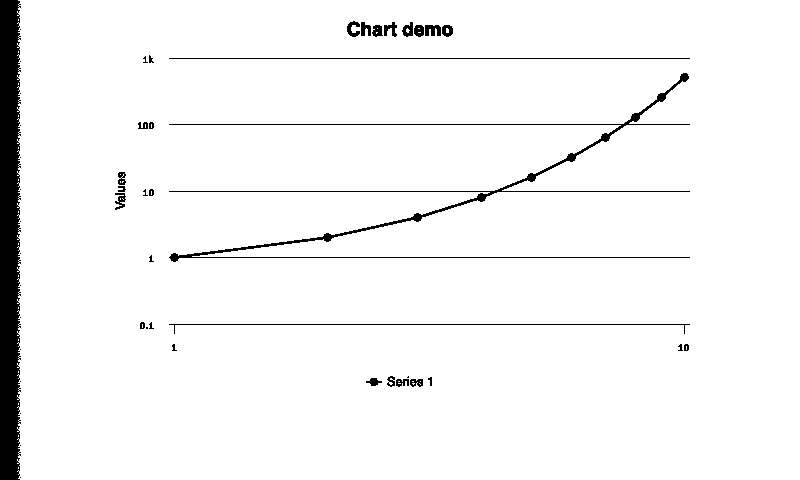
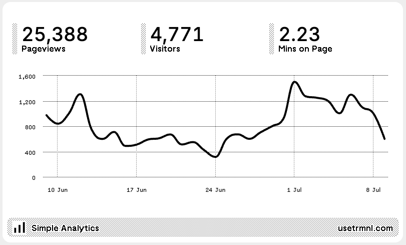

# Screen Templating (Graphics)

## Overview

The TRMNL design system is actively improving to suit the needs of our [growing plugin directory](https://trmnl.com/integrations) and requests from developers like you.

As we extend [native components](https://trmnl.com/framework), you are welcome to provide in-line styling to plugin markup to achieve your desired effect.

You may also included 3rd party libraries, for example [Highcharts](https://www.highcharts.com/), to create data visualizations like charts and graphs.

## Quickstart

Here's some example Markup content that will render an _ugly_ line chart:

```
<script src="https://code.highcharts.com/highcharts.js"></script>
<script src="https://cdn.jsdelivr.net/npm/chartkick@5.0.1/dist/chartkick.min.js"></script><div class="screen">

<div class="layout">
  <div id="container">
  </div>
</div>
<script>
Highcharts.chart("container", {
    title: {
        text: "Chart demo"
    },
    credits: { enabled: false },
    xAxis: {
        tickInterval: 1,
        type: "logarithmic"
    },
    yAxis: {
        type: "logarithmic",
        minorTickInterval: 0.1,
    },
    tooltip: {
        headerFormat: "<b>{series.name}</b><br />",
        pointFormat: "x = {point.x}, y = {point.y}"
    },
    series: [{
        data: [1, 2, 4, 8, 16, 32, 64, 128, 256, 512],
        pointStart: 1
    }]
});
</script>
```

If this is saved into a [Private Plugin](https://trmnl.com/plugin_settings?keyname=private_plugin) > Markup field, the following screen will be rendered:

<figure><figcaption><p>Un-styled chart example</p></figcaption></figure>

As you can see, this isn't pretty (yet).&#x20;

Here's another line chart with TRMNL-friendly styling:

<figure><figcaption><p>Styled line chart example</p></figcaption></figure>

Get all the code + learn how to do this here:\
[https://trmnl.com/framework/chart](https://trmnl.com/framework/chart)

## More Charts and Graphs

Our [Framework docs](https://trmnl.com/framework) are the best place for the latest examples and tips to improve the look and feel of graphical embeds from 3rd party tools like Highcharts.
