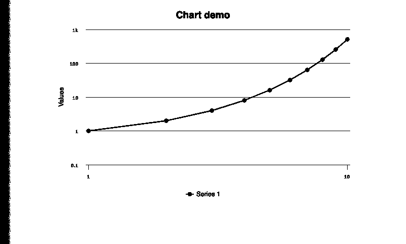
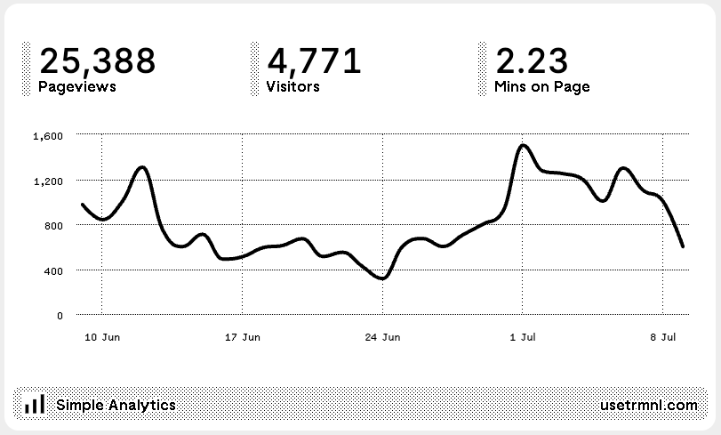

# Screen Templating (Graphics)

## Overview

The TRMNL design system is actively improving to suit the needs of our [growing plugin directory](https://trmnl.com/integrations) and requests from developers like you.

As we extend [native components](https://trmnl.com/framework), you are welcome to provide in-line styling to plugin markup to achieve your desired effect.

You may also include 3rd party libraries, for example [Highcharts](https://www.highcharts.com/), to create data visualizations like charts and graphs.

## Quickstart

Here's some example Markup content that will render an _ugly_ line chart:

```
<script src="https://trmnl.com/js/highcharts/12.3.0/highcharts.js"></script>

<div class="layout">
  <div id="container">
  </div>
</div>
<script>
Highcharts.chart("container", {
    chart: { animation: false },
    plotOptions: { series: { animation: false } },
    title: {
        text: "Chart demo"
    },
    credits: { enabled: false },
    xAxis: {
        tickInterval: 1,
        type: "logarithmic"
    },
    yAxis: {
        type: "logarithmic",
        minorTickInterval: 0.1,
    },
    tooltip: {
        headerFormat: "<b>{series.name}</b><br />",
        pointFormat: "x = {point.x}, y = {point.y}"
    },
    series: [{
        data: [1, 2, 4, 8, 16, 32, 64, 128, 256, 512],
        pointStart: 1
    }]
});
</script>
```

If this is saved into a [Private Plugin](https://trmnl.com/plugin_settings?keyname=private_plugin) > Markup field, the following screen will be rendered:

<figure><figcaption><p>Un-styled chart example</p></figcaption></figure>

As you can see, this isn't pretty (yet).&#x20;

Here's another line chart with TRMNL-friendly styling:

<figure><figcaption><p>Styled line chart example</p></figcaption></figure>

Get all the code + learn how to do this here:\
[https://trmnl.com/framework/chart](https://trmnl.com/framework/chart)

## How we render JavaScript

We load your markup in a real browser, wait for it, then take a screenshot. A few rules follow from that:

* **Draw on page load.** We wait up to 5 seconds for the page to finish loading (and for any Highcharts charts to finish drawing), then freeze `setTimeout`, `setInterval` + `requestAnimationFrame` before the screenshot. Anything scheduled for later never runs. If the page isn't ready in time *and* logged a console error, the render fails.
* **Turn off animations.** A chart captured mid-animation looks half drawn, hence `animation: false` above.
* **Load libraries from TRMNL when you can.** We host Highcharts at `https://trmnl.com/js/highcharts/12.3.0/` (plus `highcharts-more.js` + `pattern-fill.js`), which is what the [chart examples](https://trmnl.com/framework/chart) use.
* **Skip a render from JS.** Set `window.TRMNL_SKIP_DISPLAY = true` to take this plugin out of your playlist rotation until a later render drops the flag, or `window.TRMNL_SKIP_SCREEN_GENERATION = true` to keep showing the previous screen.

## More Charts and Graphs

Our [Framework docs](https://trmnl.com/framework) are the best place for the latest examples and tips to improve the look and feel of graphical embeds from 3rd party tools like Highcharts.
