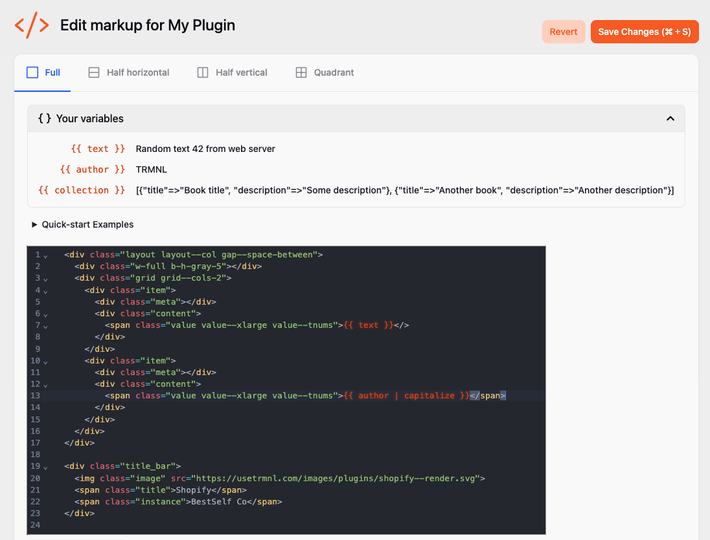

# Screen Templating

## Overview

The TRMNL OG device is an **800x480 pixel e-ink display** that renders black + white (1-bit) or 4 shades of gray (2-bit). This means we had to abandon a lot of modern web styling techniques. Learn more about this process [here](https://trmnl.com/blog/design-system).

Other devices, like [TRMNL X](https://trmnl.com/blog/introducing-trmnl-x) + [BYOD](../diy/byod.md) screens, have their own sizes and bit depths -- the Framework adapts the same markup to each.

For the latest documentation on building beautiful plugins with TRMNL, see our Framework docs:\
[https://trmnl.com/framework](https://trmnl.com/framework)

### Quickstart (TRMNL account)

The easiest way to start building with TRMNL is by [making a Private Plugin](https://trmnl.com/plugin_settings?keyname=private_plugin) from inside your account. This includes an inline editor, merge variable interpolation, and a live previewer.

<figure><figcaption><p>TRMNL markup editor with live preview</p></figcaption></figure>

### Quickstart (no TRMNL account)

Create an HTML file with our plugins CSS + JS embedded in the `<head>`.

The example below has simple markup for a "full" layout plugin. We also offer half vertical, half horizontal, and quadrant sized layouts.

**NOTE:** This code includes `view` classes that are specific to public plugin development, _**not**_ to be used within TRMNL editor.

```erb
<!DOCTYPE html>
<html>
  <head>
    <link rel="stylesheet" href="https://trmnl.com/css/latest/plugins.css">
    <script src="https://trmnl.com/js/latest/plugins.js"></script>
  </head>
  <body class="environment trmnl">
    <div class="screen">
      <div class="view view--full">
        <div class="layout">
          <div class="columns">
            <div class="column">
              <div class="richtext richtext--center">
                <span class="title">Motivational Quote</span>
                <div class="content content--center">“I love inside jokes. I hope to be a part of one someday.”</div>
                <span class="label label--underline">Michael Scott</span>
              </div>
            </div>
          </div>
        </div>
        
        <div class="title_bar">
          
          <span class="title">Plugin Title</span>
          <span class="instance">Instance Title</span>
        </div>
      </div>
    </div>
  </body>
</html>
```

The above markup should produce a screen like this:

<figure><figcaption><p>Sample screen render with TRMNL's plugin CSS stylesheet</p></figcaption></figure>

Fonts (Inter + our pixel fonts) load from `plugins.css`, so there's nothing else to add to your `<head>`.

### Customize and make it dynamic

Use our [Framework Docs](https://trmnl.com/framework) to enhance your design and show/hide logic (example: [overflow management](https://trmnl.com/framework/overflow), [number formatting](https://trmnl.com/framework/format_value)).

When you're satisfied with the design, replace dynamic content with `{{ variable }}` references. TRMNL uses the [Liquid templating library](https://shopify.github.io/liquid/) by Shopify to interpolate values into your template markup. You can then save it into your Private Plugin's Markup Editor, which has a tab per layout (Full, Half Horizontal, Half Vertical, Quadrant) plus a Shared tab whose markup is prepended to every layout.


[Tutorial - How to create a custom plugin](https://help.trmnl.com/en/articles/9510536-custom-plugins)


**Note**: You may also leverage [Liquid Filters](https://shopify.github.io/liquid/filters/abs/) to reduce the sanitization required by the service producing data for your TRMNL plugins. On top of the standard set we ship [custom filters](https://help.trmnl.com/en/articles/10347358-custom-plugin-filters) like `number_to_currency`, `number_with_delimiter`, `days_ago`, `l_date`, `pluralize`, `group_by`, `find_by`, `where_exp`, `markdown_to_html`, `parse_json` + `qr_code`. For example, `{{ 10 | number_to_currency }}` renders "$10.00". Shopify's store-only filters like `money` don't exist in TRMNL.

### Built-in variables

Every private plugin also receives a `trmnl` object alongside your own data:

* `trmnl.user` -- `id`, `name`, `first_name`, `last_name`, `locale`, `time_zone`, `time_zone_iana`, `utc_offset` (seconds)
* `trmnl.device` -- `friendly_id`, `width`, `height`, `orientation`, `percent_charged`, `wifi_strength`
* `trmnl.system.timestamp_utc` -- when the screen was rendered
* `trmnl.plugin_settings` -- `instance_name`, `strategy`, `custom_fields_values` (your [form field](https://help.trmnl.com/en/articles/10513740-custom-plugin-form-builder) values), and `data_fetched_utc` once data has been fetched
* `trmnl.state` -- data your [Serverless](https://help.trmnl.com/en/articles/14130649-serverless) transform saved for the next refresh

Browse the full, live set in the Markup Editor's "Your variables" dropdown.
