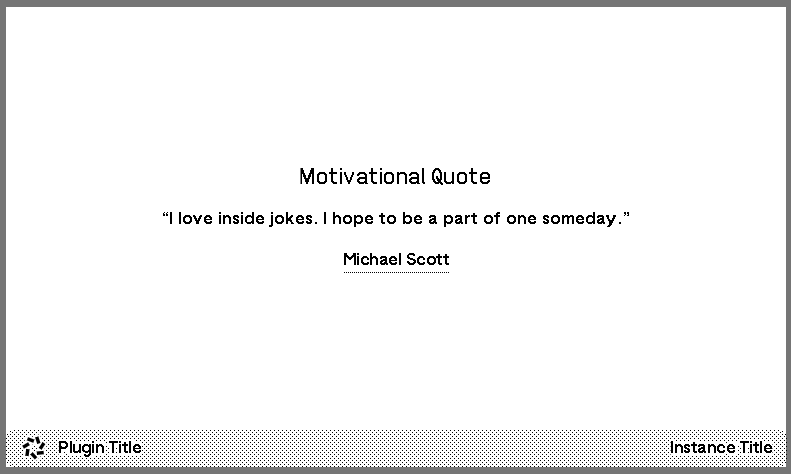

# Screen Templating

## Overview

The TRMNL OG device is an **800x480 pixel, black and white, 2-bit grayscale display**. This means we had to abandon a lot of modern web styling techniques. Learn more about this process [here](https://trmnl.com/blog/design-system).

For the latest documentation on building beautiful plugins with TRMNL, see our Framework docs:\
[https://trmnl.com/framework](https://trmnl.com/framework)

### Quickstart (TRMNL account)

The easiest way to start building with TRMNL is by [making a Private Plugin](https://trmnl.com/plugin_settings?keyname=private_plugin) from inside your account. This includes an inline editor, merge variable interpolation, and a live previewer.

<figure><figcaption><p>TRMNL markup editor with live preview</p></figcaption></figure>

### Quickstart (no TRMNL account)

Create an HTML file with our plugins CSS + JS embedded in the `<head>`.

The example below has simple markup for a "full" layout plugin. We also offer half vertical, half horizontal, and quadrant sized layouts.

```erb
<!DOCTYPE html>
<html>
  <head>
    <link rel="stylesheet" href="https://trmnl.com/css/latest/plugins.css">
    <script src="https://trmnl.com/js/latest/plugins.js"></script>
  </head>
  <body class="environment trmnl">
    <div class="screen">
      <div class="view view--full">
        <div class="layout">
          <div class="columns">
            <div class="column">
              <div class="markdown">
                <span class="title">Motivational Quote</span>
                <div class="content content--center">“I love inside jokes. I hope to be a part of one someday.”</div>
                <span class="label label--underline">Michael Scott</span>
              </div>
            </div>
          </div>
        </div>
        
        <div class="title_bar">
          
          <span class="title">Plugin Title</span>
          <span class="instance">Instance Title</span>
        </div>
      </div>
    </div>
  </body>
</html>
```

The above markup should produce a screen like this:

<figure><figcaption><p>Sample screen render with TRMNL's plugin CSS stylesheet</p></figcaption></figure>

Note: in some cases you may need to include the 'Inter' font (inside the `<head>`) to achieve the same look and feel as TRMNL's in-browser markup editor described above:

```
<link rel="preconnect" href="https://fonts.googleapis.com">
<link rel="preconnect" href="https://fonts.gstatic.com" crossorigin>
<link href="https://fonts.googleapis.com/css2?family=Inter:wght@300;350;375;400;450;600;700&display=swap" rel="stylesheet">
```

### Customize and make it dynamic

Use our [Framework Docs](https://trmnl.com/framework) to enhance your design and show/hide logic (example: [overflow management](https://trmnl.com/framework/overflow), [number formatting](https://trmnl.com/framework/format_value)).

When you're satisfied with the design, replace dynamic content with `{{ variable }}` references. TRMNL uses the [Liquid templating library](https://shopify.github.io/liquid/) by Shopify to interpolate values into your template markup. You can then save


[Tutorial - How to create a custom plugin](https://help.trmnl.com/en/articles/9510536-custom-plugins)


**Note**: You may also leverage [Liquid Filters](https://shopify.dev/docs/api/liquid/filters) to reduce the sanitization required by the service producing data for your TRMNL plugins. For example, you can convert "10" to "$10.00" via [money\_with\_currency](https://shopify.dev/docs/api/liquid/filters/money).
